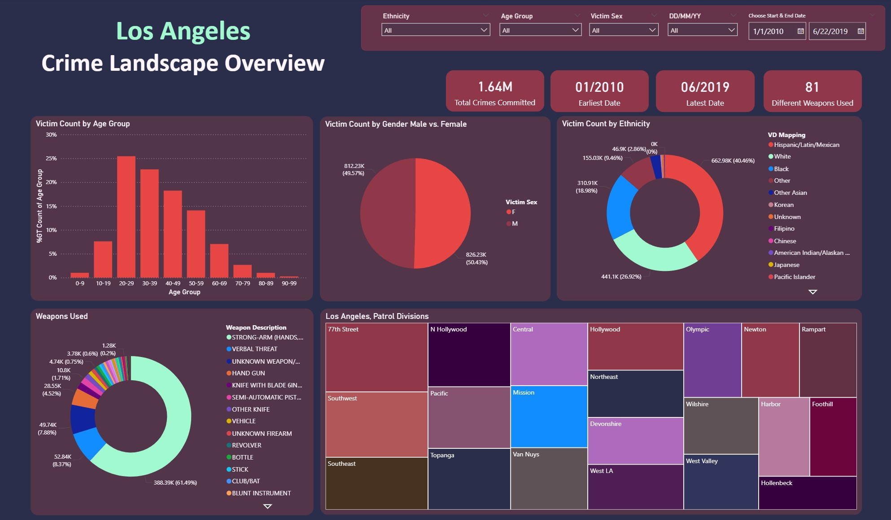
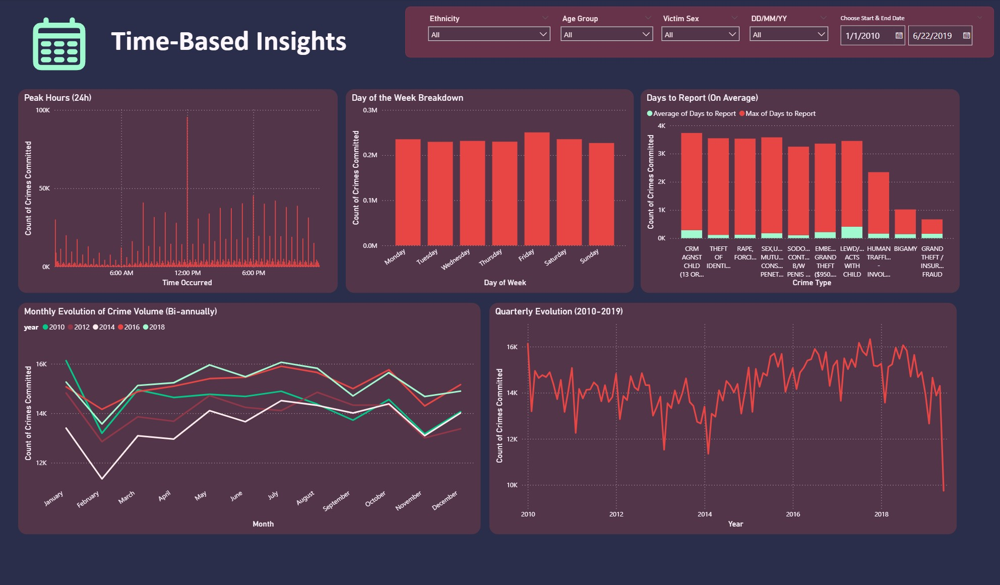
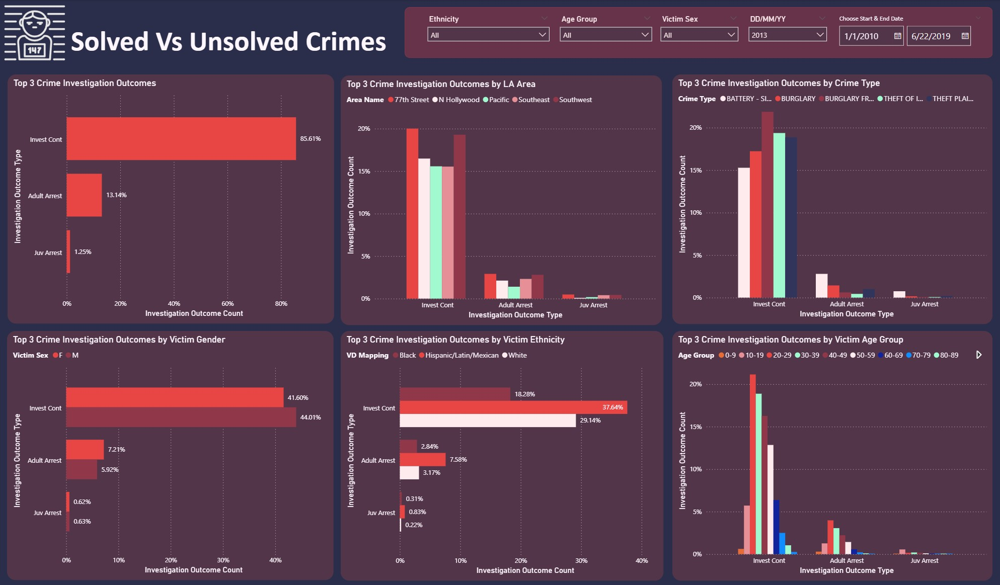
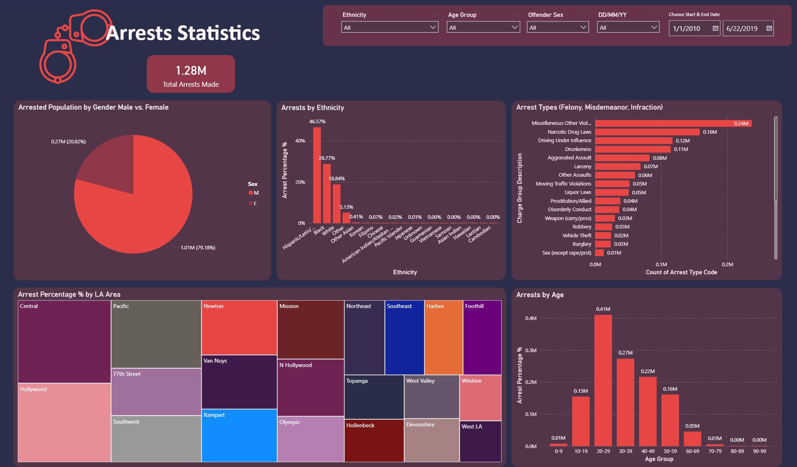

# LA Crime and Arrest Data (2010–2019)

This project presents an exploratory data analysis (EDA) of crime and arrest data in Los Angeles, covering the period from January 2010 to June 2019. The analysis aims to identify key demographic, geographic, and temporal patterns in reported crimes and arrests, using interactive visualisations developed in Power BI.

---

## Team Members
- [Ioanna Birmpili]() 
- [Areti Krontiri]()  
- [Antonis Dagkalidis](https://github.com/adagk)  

---

## Data Source
The analysis is based on publicly available crime data for the City of Los Angeles:  
[Kaggle Dataset: Los Angeles Crime and Arrest Data (2010–2019)](https://www.kaggle.com/datasets/cityofLA/los-angeles-crime-arrest-data/data?select=crime-data-from-2010-to-present.csv)

---

## Tools & Technologies
- Python (data cleaning & preprocessing)
- Power BI (data modelling & visualisation)

---

## Power BI Dashboard
The full interactive dashboard can be accessed here:  
[Power BI Dashboard – LA Crime and Arrest Data](https://drive.google.com/drive/folders/1zek_cmsfLt_jWUCuc2ZJI8EEgyJFRBtp?usp=drive_link)

---

## Project Overview

The dataset contains approximately 1.64 million recorded crime incidents. The analysis focuses on:
- Victim demographics (age, gender, ethnicity)
- Crime types and offense categories
- Weapon involvement
- Temporal patterns (time of day, weekday, long-term trends)
- Geographic distribution and crime hotspots
- Arrest outcomes and unsolved cases

Overall, the findings indicate that crime in Los Angeles is concentrated among working-age populations, with an almost equal gender distribution and higher victimisation rates among Hispanic/Latino communities. Distinct geographic areas consistently report higher crime volumes, while arrest rates vary significantly by crime type and location.

---

## Dashboard Structure & Key Insights

### General Overview
Provides a high-level summary of total crime incidents, victim demographics, and overall trends across the study period.

---

### Crime Types
Explores the most frequent crime categories and examines how offense patterns vary by age group, gender, and geographic area. The section also highlights changes in the ranking of major crime types over time.

---

### Victim Demographics
Focuses on victim profiles, presenting distributions by gender, age group, and ethnicity, and linking demographic characteristics to major crime categories.

---

### Weapon Involvement
Examines weapon usage in crimes where weapon information is available (approximately 60% of incidents). The analysis compares weapon patterns across crime types and geographic areas.

---

### Temporal Analysis
Analyses crime patterns by hour of day, day of week, reporting delays, and long-term monthly and yearly trends.

---

### Geographic Distribution
Identifies crime hotspots across the ten areas with the highest crime volumes, including a comparison between 2010 and 2018 (excluding 2019 due to partial data availability).

---

### Crime Status & Arrests
Explores solved versus unsolved crimes, arrest rates over time, and differences by victim demographics and geographic area. Arrest patterns are further analysed by offender characteristics and offence severity.

